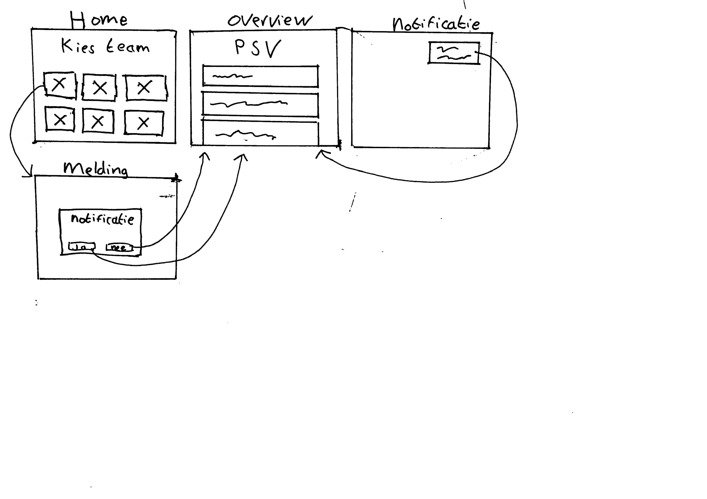

# Browser Technologies - notification

[Live link](https://notification-team.herokuapp.com/)

## Wireflow
Before i started building the app, i sketched a wireflow to thing about the design and the flow of the app. Below you will find version 1 of the wireflow.



For version 1 of the wireflow i received feedback. It was not very clear what the different layers where in this design. I sketched the app from scratch with the layers more in mind.


## The app flow
When you open the app, you start on the homepage. Here you will see the current game if there is one. If there is no live game at the moment, the app will show you the last played game.
Below that you can choose a team that you like to follow for score updates. If you click on one of them, the team page will open. Here it will ask you if you want to receive notifications. If you allow it, every goal for the selected team, you will receive a notification
For the selected team you see the current score and below that all updates that happend. After receiving a notification, the score will update and a new update will render.

I build the app to render it on the server. This way the whole app will still work if you have your JavaScript disabled.

### Functional layer
The core functionality will work even if you have no CSS or JavaScript enabled. The app will look less attractive, but everything excluding the notifications will still work. You get asked if you want to receive emails instead of notifications if JavaScript is disabled.

### Usable layer
If CSS is enabled, the app looks at its best with colours and styling. The app still works even without JavaScript. But there is not auto reloading or real time notifications.

### Pleasurable layer
If everything is turned on, you will receive notifications for any status updates. Also the page will automatically reload if there are updates available. If JavaScript is turned off, the page will reload every minute automatically.

## What is progressive enhancement?
Progressive Enhancement is a methodology that allows web developers to concentrate on building the best possible websites while balancing the issues inherent in those websites being accessed by multiple unknown user-agents.

## Browser Technologies features
### Images
If images are turned off, it gives the alt tag back with a description of the image itself.

### Custom fonts
I used a custom font for the app. If the app fails to load this font from Google Fonts. It will give a fallback of sans serif.

### Colours
The all color blindless, the app still looks good on contrast. No issues at all.


### Mouse/trackpad
You can navigate through to app itself just with the tab and enter enter. No mouse is required if you don’t have one.

### No fast internet
All files are optimized to a smaller size. So everything will load as quick as possible.

### JavaScript disabled
If JavaScript is disabled, the app still works normally. Only the advanced features like live reloading and notifications will not work.

### Cookies
I’m not using cookies in this app.

### LocalStorage
I’m not using LocalStorage in this app.

### Screenreader
The screenreader reads everything as shown on the page.

## Browser Compatibility
If you look at my main feature, notifications. There is no support at some of the browsers. I checked caniuse.com to check which browsers are not working.


Here you can see that:
- Safari iOS
- Opera Mini
- IE 11
- IE Mobile
- UC Browser for Android
- QQ Browser
- Baidu Browser

Are not supporting notifications.

## Second itaration
With the feedback session i got some points where i needed to work on.
 1. Add score to the update banners
 2. Add a meta tag for refreshing if JavaScript is disabled
 3. Ask to user for notificiations on the team page
 4. Clear the alt tags for the logos
 5. Ask for an email if notifications are not supported or JavaScript is disabled

These points i worked on to make the app better.
 1. I addedd a more descriptive message to the update banners. Now the score is included for the team you are supporting.


 2. I added the no script tag in the header if JavaScript is diabled or is not able to load. This way, the page will auto reload every 60 seconds. If JavaScript is enabled, the browser will automatically reload if there is an update.

```javascript 
<noscript>
	<meta http-equiv="refresh" content="60">
</noscript>
```

3. If JavaScript is enabled, you get asked if you want to receive notifications. If you click on the link, the browser asks you if you want to receive them. This is happening if you click on you favorite team.

4. I cleared all the alt tags on the logo's. The alt tags are not necessary because the team name is rendered below the image. I kept the alt tags however on the current team scores. This is because the neam of the team is not already displayed here.

5. If JavaScript is disabled, or notifications are not supported, the browser asks you if you want to receive e-mail notifications instead.