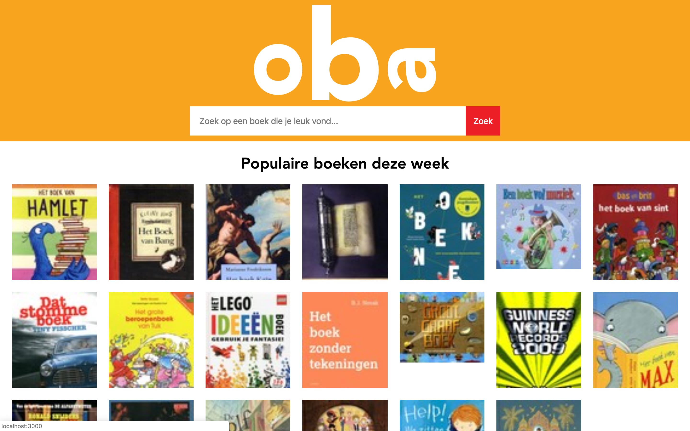
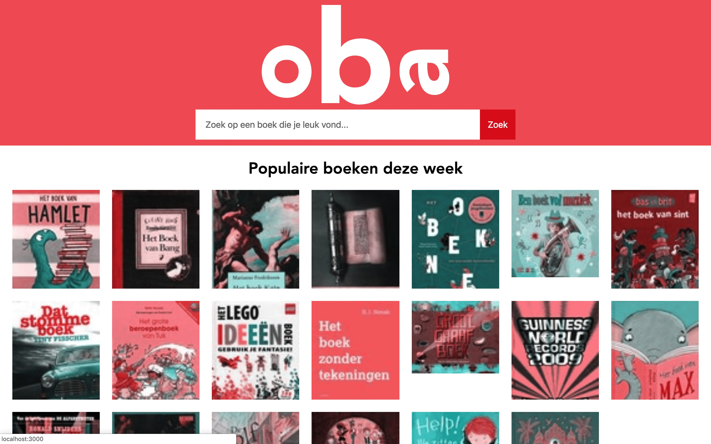
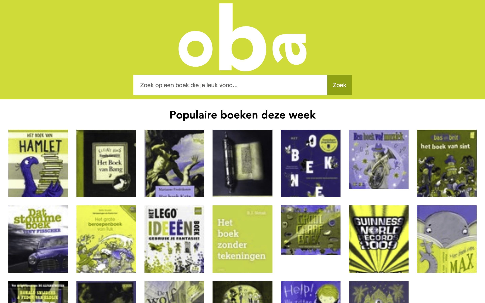

# Browser Technologies
## Features to test
Colors
Custom fonts
Images
No mouse or trackpad
No JavaScript
Broadband
Cookies
localStorage 
Screenreader

### Colors
I installed a Chrome plugin to check for color blindness on my OBA app. The app that i installed is called: [Colorblindly](https://chrome.google.com/webstore/detail/colorblindly/floniaahmccleoclneebhhmnjgdfijgg).

Colorblindness is not an issue for my app. On every tone of color it is still visible for the user.

### Custom fonts
I used the font 'Avenir'. This is a web safe font installed on every device. For fallback, if the font is deleted from a device, i put san-serif as a fallback.

### Images
If you turn off images in the browser, you still see the logo as a SVG. All the images are gone and you will see an alt tag.

### No mouse and trackpad
The tab key doesn't detect the a tags on the page only the inputs.

I inserted a tabindex of 0 on every a tag on the page. Now the tab does detect all the a tag and also the input fields.

### No JavaScript
If i turn off JavaScript in my browser, app stil works as should. I think that's because everything is written on the server side.

### Broadband
To load everything as fast as possible, i compressed the CSS file. That was the biggest file to load. I have no JavaScript to run in the browser so there is nothing to load there. All images are small at the moment. They come from a JSON file.

### Cookies
I'm not using cookies.

### localStorage
I'm not using localStorage.

### Screen reader
I used the Google Chrome extension [ChromeVox](https://chrome.google.com/webstore/detail/chromevox/kgejglhpjiefppelpmljglcjbhoiplfn?hl=nl) to test my OBA app.
It spoke all alt tags of my images as well as the input field.